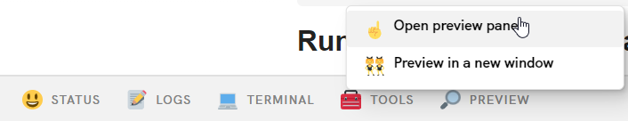
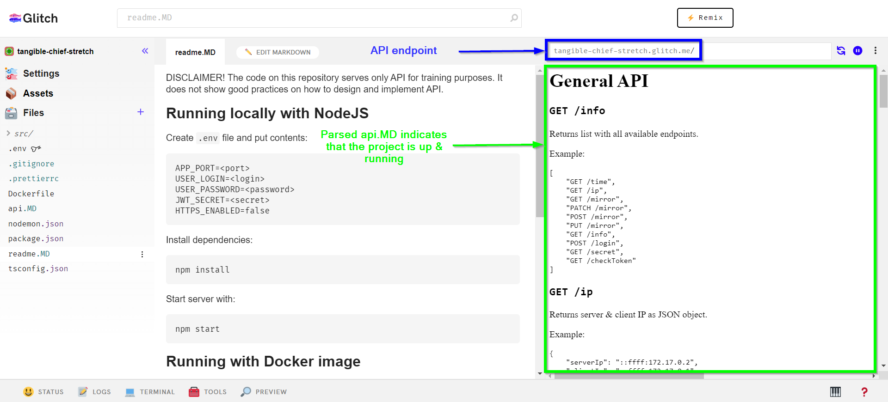
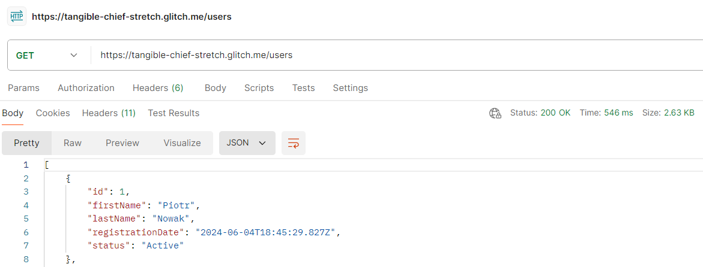

DISCLAIMER! The code on this repository serves only API for training purposes. It does not show good practices on how to design and implement API.

# Running locally with NodeJS

Create `.env` file and put contents:
```
APP_PORT=<port>
USER_LOGIN=<login>
USER_PASSWORD=<password>
JWT_SECRET=<secret>
HTTPS_ENABLED=false
```

Install dependencies:
```
npm install
```

Start server with:
```
npm start
```

# Running with Docker image

Compile docker file:
```
docker build -t training-api-server .
```

Start server:
```
docker run -p <app_port>:<app_port> -e APP_PORT=<app_port> -e USER_LOGIN=<login> -e USER_PASSWORD=<password> -e JWT_SECRET=<secret> training-api-server
```

Example:
```
docker run -p 3000:3000 -e APP_PORT=3000 -e USER_LOGIN=admin -e USER_PASSWORD=admin1 -e JWT_SECRET=secret training-api-server
```

# HTTPS support

In order to enable HTTPS, set the config flag to true and add https certificate public/private keys path:
```
HTTPS_ENABLED=true
PRIVATE_KEY_PATH=/path/to/privkey.pem
CERTIFICATE_PATH=/path/to/fullchain.pem
```


# Running on Glitch.com

1) Remix this project:

[](https://glitch.com/edit/#!/import/github/ppnowak/training-api-server)

2) Expand preview mode by clicking "Previev" > "Open preview panel" on the bottom



3) Wait for application to install and run



4) Copy URL and use API

